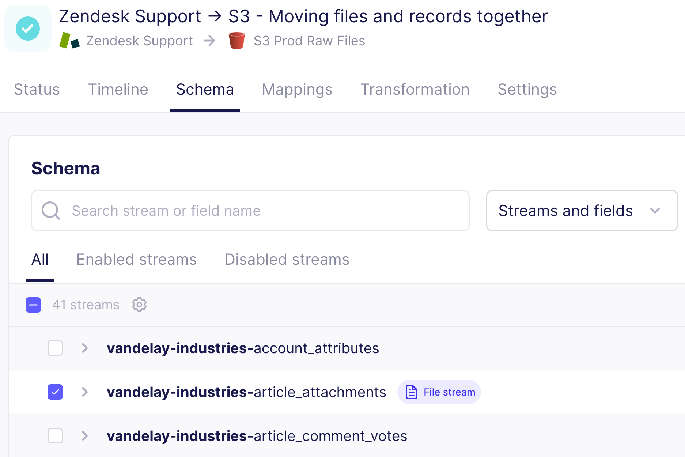

# Airbyte 1.8

Why don't Docker containers get lost in Kubernetes? Because Helm charts the right course! Airbyte 1.8 was released on August 11, 2025. We're excited to share new improvements and changes to the Airbyte platform.

## Platform changes

These changes improve Airbyte for everyone.

### Pagination for better UI performance

Airbyte has added pagination to many pages in the user interface. This provides a critical performance boost for workspaces with hundreds or thousands of connections. As you scroll, pages automatically add new data until you reach the end of the list.

<Arcade id="MzPzDliaqgyf2NmlmSWy" title="" paddingBottom="calc(60% + 0px)" />

You can find pagination in the following places:

- The **Sources**, **Destinations**, and **Connections** pages.

- The **source** and **destination** details pages

- The **Define Source** and **Define Destination** pages when setting up a new connection: we've added manual pagination and search bars to make it easier to find existing sources and destinations.

You might notice slight visual and content differences on some pages as a result of this change. For example, when upgrading a connector version, Airbyte no longer lists all the connections affected by the upgrade. These messages were too long for workspaces with many connections.

### File streams indicated in the UI

If a connection contains a stream that moves files, Airbyte's UI now indicates this on the connection's schema tab. [**Learn more&nbsp;>**](/platform/using-airbyte/sync-files-and-records)

### Helm chart V2 is available

A new Helm chart is available for you to use in your deployments. Migrating to this new chart is currently optional. In a future version of Airbyte, Helm chart V2 will be mandatory.

- New deployments should use Helm chart V2 from the start to avoid a future upgrade. The [Deployment documentation](/platform/deploying-airbyte/) includes examples for this Helm chart.

- Existing deployments can migrate at the time of your choosing. Schedule a convenient time to migrate so you aren't blocked from upgrading to a future version. For help and to learn more, see the migration guides for [Self-Managed Community](/platform/deploying-airbyte/chart-v2-community) or [Self-Managed Enterprise](/platform/enterprise-setup/chart-v2-enterprise).

- Version 0.30 of abctl uses Helm chart V2 by default when installing new versions of Airbyte.

## Early access

Airbyte's working toward some big product milestones. Some of these improvements are available for you to use today.

### Data activation and reverse ETL

Airbyte now supports data activation and reverse ETL use cases. Data activation enables you to move data out of your data warehouse and into the operational tools where work happens, like CRMs, marketing platforms, and support systems. With this capability, you can deliver modeled data directly to points of action and systems people already use, helping your organization respond faster and more effectively. Customer IO and HubSpot destinations are already available. [**Learn more&nbsp;>**](/platform/move-data/elt-data-activation)

## Self-Managed Enterprise changes

These changes bring new capabilities to Airbyte's Self-Managed Enterprise customers.

### Enterprise Salesforce destination

To support Airbyte's data activation capabilities, a new [Salesforce](../integrations/enterprise-connectors/destination-salesforce) destination is available exclusively to enterprise customers for an additional charge.

## Fixes

This version fixes the following issues that our users reported.

- Fixed an issue that caused the authentication button to not work when you set up connectors.

- Fixed an issue that caused database migrations to fail when there was a single data plane group named "AUTO".

- Fixed an issue that failed to remove the stream state for disabled streams on connections with global states. This could cause CDC-based connections to fail on refreshes.

- Fixed an issue that didn't clear the connection state when switching a connection from Incremental to Full Refresh. This could cause Airbyte to fail to populate all records in the destination during a full refresh.

- Fixed a rare typing and deduping issue where Airbyte could exit a job prematurely, incorrectly believing there had been a heartbeat failure. This could cause final tables to be missing data after a full refresh, even though the raw table populated correctly.

- Removed a duplicate `AB_JWT_SIGNATURE_SECRET` key that prevented upgrades with Helm.

- Fixed an issue that could cause the Airbyte UI to show that it was refreshing more streams than it actually was.

## How to upgrade

For help, see [Upgrading Airbyte](/platform/operator-guides/upgrading-airbyte).

## Breaking changes

This version includes the following breaking change. For a list of all breaking changes from recent versions, see [Breaking change list](breaking-changes).

### `airbyte-webapp` is removed

Airbyte has removed `airbyte-webapp` and merged its functions into `airbyte-server`. We'll no longer publish a webapp image and webapp is no longer independently deployable. It's likely you need to take one of the following actions when you upgrade.

- If you deploy Airbyte with abctl, ensure your version of abctl is compatible with this version of Airbyte.
- If you deploy Airbyte with Helm, update any rules in your ingress controller that direct to `airbyte-webapp`.

If you used version 1.7, you probably already completed these tasks. If not, make these necessary changes before upgrading to version 1.8. [**Learn more&nbsp;>**](/platform/deploying-airbyte/integrations/ingress-1-7)

## Patch releases

### Version 1.8.1

Airbyte 1.8.1 was released on August 20, 2025.

- This patch release addresses an issue with data plane name constraints that prevented successful abctl uninstall/reinstall operations. We removed the unique constraint on data plane names and added UUID generation to the naming process. This resolves failures during abctl uninstall/reinstall operations that were caused by name constraint violations.

### Version 1.8.2

Airbyte 1.8.2 was released on September 2, 2025.

- If you use single sign on with generic OIDC, you can now set extra scopes in the Helm chart using `global.auth.identityProvider.genericOidc.extraScopes` in your values.yaml file. These extra scopes are included in the authorization code flow. Extra scopes are sometimes required by identity providers like Entra ID and provide web apps with valid JSON web tokens.

- Fixed an issue that prevented Airbyte from validating license info.

- Fixed an issue in Airbyte's Help menu that incorrectly set the app version to "dev."
